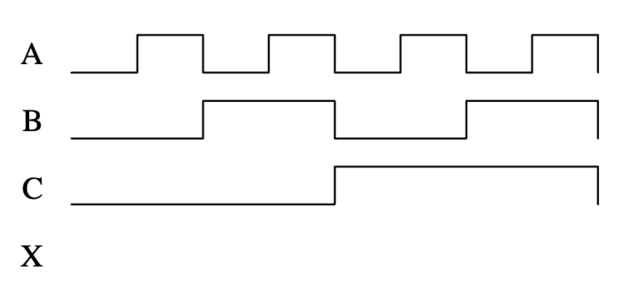
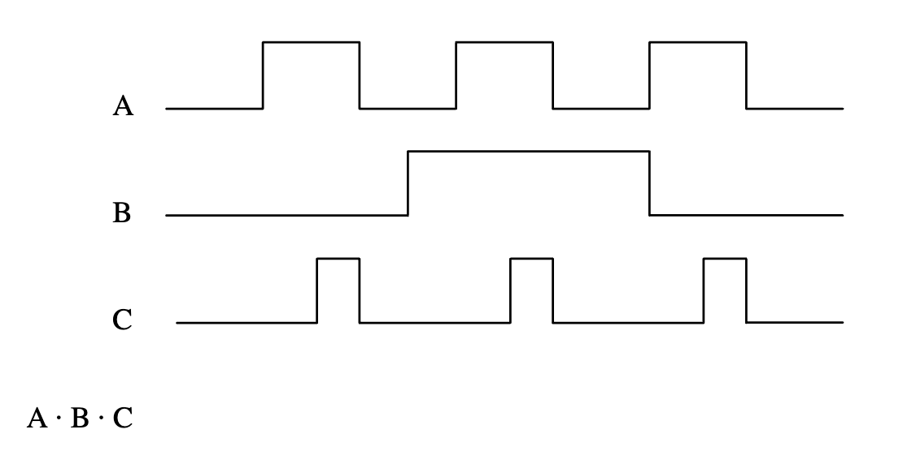
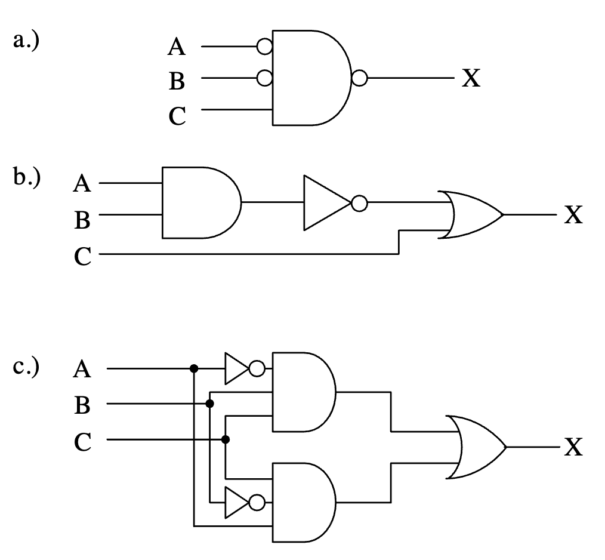
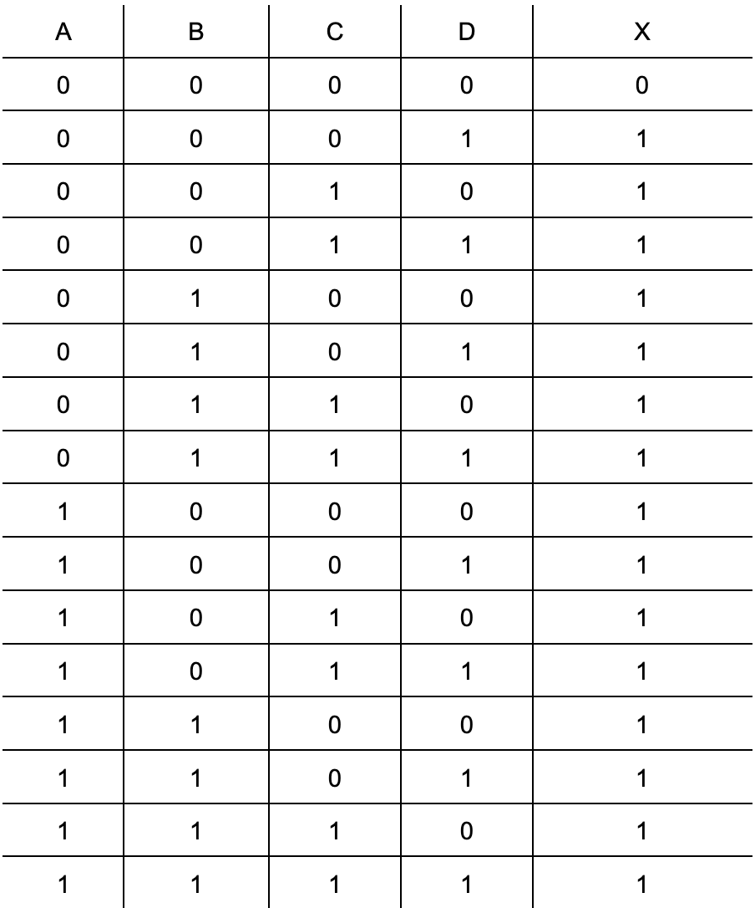
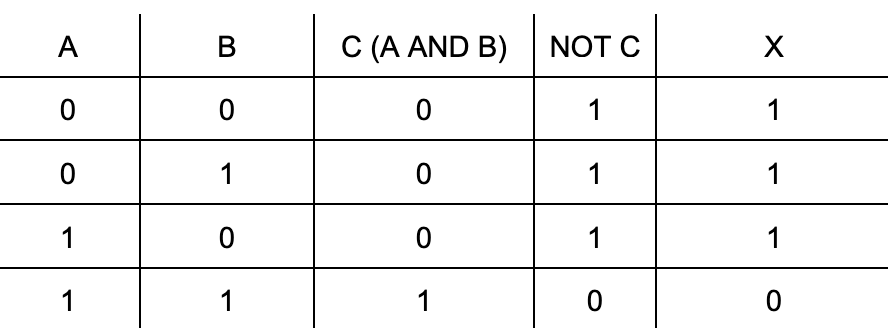
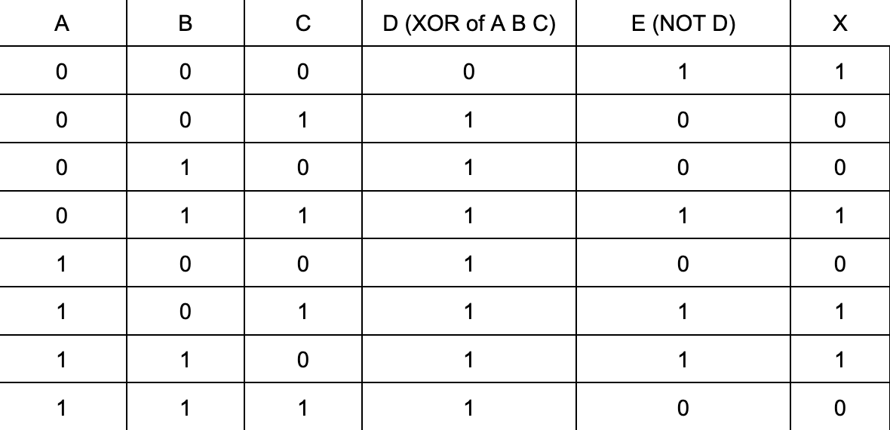

# Gates, expressions, circuits, and analysis

## Reading Notes

### Logic Functions and Gates
Todo

#### Practice Problems 
1. Identify a real-world example for an AND gate and one for an OR gate other than those presented in this chapter. [Solution](#solution1)
2. How many rows does the truth table for a 4-input logic gate have? [Solution](#solution2)
3. Construct the truth table for a four-input OR gate. [Solution](#solution3)
4. Construct the truth table for a two-input NAND gate. [Solution](#solution4)
5. Construct the truth table for a three-input Exclusive-NOR gate. [Solution](#solution5)
6. Construct the truth table for a three-input OR gate using "don't cares" for the inputs similar to the truth table constructed for the three-input AND gate shown in Figure 4-13.
7. Draw the output X for the pattern of inputs shown in the figure below for a three input NAND gate.

8. Repeat problem 7 for a NOR gate.
9. Show the output waveform of an AND gate with the inputs A, B, and C indicated in the figure below.

10. Develop the truth table for each of the combinational logic circuits shown below.

#### My solutions 

1. **OR**: For hybrid cars, you can either use gas or electricity. If you are out of gas, you switch to electricity and you are still able to drive. If you are out of battery, you switcht to gas and you are still able to drive. If you do not have gas or battery, you can not drive. 

    In this case, the inputs would be the gas and battery. If gas is 0 (no gas) and battery is 1 (has electricity), the output is 1. And vice versa. If both are 0, then you can not drive, so output is 0. 

    **AND**: To use my mouse, I need to the USB-C connected to my computer AND the mouse has to be on. If the mouse is not on (0), I can't use the mouse (output = 0). If the USB-C is not connected, then I can use my mouse and vice versa. We can take this a step above by including the computer having battery or not. 

2. For n inputs, each with the possiblilty of being a 1 or 0 (2 options), we have $2^n$ rows. So for a 4-input logic gate we have $2^4 = 16$. 

3. Truth table for a four-input OR gate.

4. Truth table for a two-input NAND gate.

5. Truth table for a three-input Exclusive-NOR gate.

6. Construct the truth table for a three-input OR gate using "don't cares" for the inputs similar to the truth table constructed for the three-input AND gate shown in Figure 4-13.

7. Draw the output X for the pattern of inputs shown in the figure below for a three input NAND gate.

8. Repeat problem 7 for a NOR gate.
9. Show the output waveform of an AND gate with the inputs A, B, and C indicated in the figure below.

10. Develop the truth table for each of the combinational logic circuits shown below.

